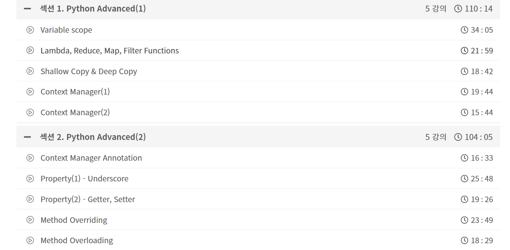
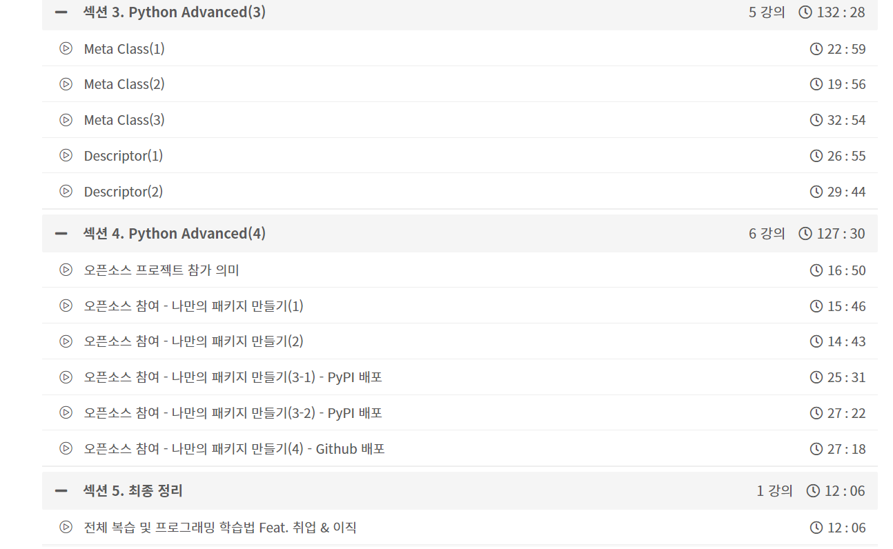

## 인프런-리프 2기 활동에 임하는 각오

- 강의 수강 전 다짐:

  파이썬을 사용한지 2년정도 되었다. 현재 데이터분석, AI 관련 업무를 하다보니, 자연스레 파이썬을 활용할 시간이 많아졌고, 어느정도 익숙하다고 생각했다. 하지만 최근에 학습 모델을 백엔드에 올려서 웹페이지에 나타내야하는 과제를 진행했었고, 이 때, 파이썬 실력이 아직 많이 부족하다는 생각을 하게 되었다. (엔지니어링 측면에서 정말 편리한 메서드가 많아보였다!) 

   파이썬 실력을 늘리기 위해 여러 강의들을 찾아보던 찰나에, 인프런-리프 2기에 신청했고, 활동을 하면서 파이썬 강의를 열심히 들으면 되겠다고 생각했다.

  
 

  
 

  가장 눈이 간 강의 였다. <b>모두를 위한 파이썬 : 필수 문법 배우기 Feat. 오픈소스 패키지 배포 (Inflearn Original)</b> 이라는 제목의 강의였고, 나만의 패키지 배포를 하는 방법을 배운다는 점이 흥미로웠다. 또한 Meta Class나 Descriptior 등 나한테는 생소한 단어들이 보여, 꼭 한 번 배우고 싶다는 생각을 했고, 열심히 활동에 참여해야겠다는 다짐을 했다!

  

- 공부 계획: 

하루에 한 강의라도 듣자는 마인드로 공부하려고 한다. 학교생활 (대학원 논문 및 다른 프로젝트들) 때문에 좀 바쁘겠지만, At least 하루 한 강의라도 들으면 좋지 않을까 생각했다.

그리고 직접 코딩 해보는 게  중요하다고 생각해서, 배운 내용을 단순히 영상만 보는 것이 아니고 직접 코드를 올려보는 계획을 갖고 있다.  

[모두를 위한 파이썬 : 필수 문법 배우기 Feat. 오픈소스 패키지 배포 (Inflearn Original)]([https://www.inflearn.com/course/%ED%94%84%EB%A1%9C%EA%B7%B8%EB%9E%98%EB%B0%8D-%ED%8C%8C%EC%9D%B4%EC%8D%AC-%EC%A4%91%EA%B3%A0%EA%B8%89/dashboard ])

