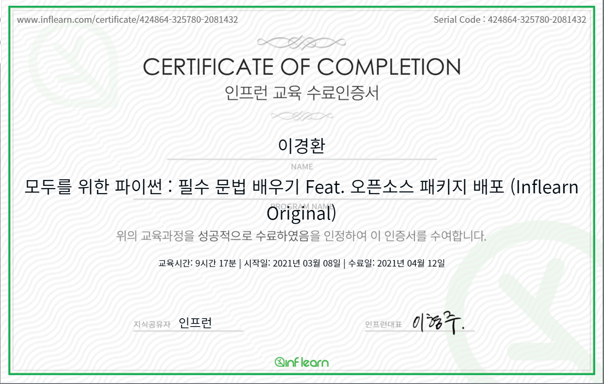

# 활동후기

 저는 현재 데이터 사이언스, AI를 공부하고 있는, 한달 뒤에 IT회사 AI연구소에 입사예정인  대학원생입니다. 파이썬 언어를 적극적으로 사용한지는 2년정도 됐고, 더 딥한 공부를 하고 싶어 인프런-리프 2기에 지원했습니다. (기존에 인프런에서 Computer Vision 관련 강의를 들은 경험이 있고, 해당 강의의 내용을 만족하여 이번 리프에 지원하게 되었습니다.)

  파이썬 고급강의를 수강했고, 해당 강의는 제가 지난 2년 동안 진지하게 고민하지 않았던 파트를 다루는 경우가 많았습니다. 특히 메타클래스 관련 강의를 배우면서는 이때까지 파이썬을 헛배웠나(?!) 싶을정도로 깊은 내용을 배워 기분이 좋았던 기억이 있습니다.

 최근에 특히 기업 인터뷰가 많았는데도 불구하고, 매주 2시간 넘는 분량의 강의를 복습하고 코드작업을 열심히 했었던 기억이 있습니다. 무사히 잘 마칠 수 있었던 거 같아 뿌듯하고, 프로그램을 기획하시느라 고생하신 인프런 운영진들에게도 감사의 인사를 전하고 싶습니다.

 끝으로, 본인이 대학생, 혹은 대학원생인데 인프런에서 양질의 강의를 듣고자 한다면, 이후에 있을 인프런 n기에 지원하는 걸 추천합니다. (확실히 양질의 강의가 많습니다! 일단 일반 강의를 하나 구입해서 들어보시고 판단하셔도 좋을 것 같네요ㅎㅎ)

  

[모두를 위한 파이썬 : 필수 문법 배우기 Feat. 오픈소스 패키지 배포 (Inflearn Original)](https://www.inflearn.com/course/%ED%94%84%EB%A1%9C%EA%B7%B8%EB%9E%98%EB%B0%8D-%ED%8C%8C%EC%9D%B4%EC%8D%AC-%EC%A4%91%EA%B3%A0%EA%B8%89/dashboard )