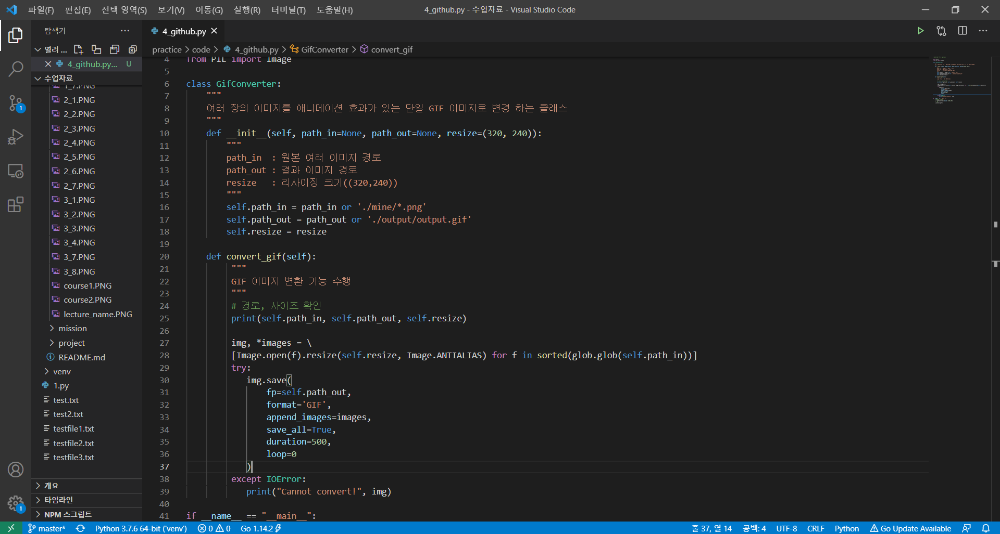
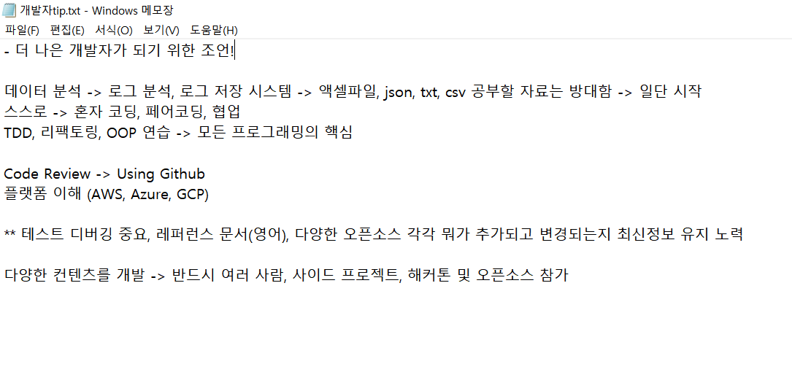

## 마지막 주차 미션- Chapter 4. Python Advanced(4) (오픈소스 프로젝트 참가 / PyPI, Github 배포)

#### 주요개념, 배운내용 및 느낀점

- 오픈소스 프로젝트 참가의 장점 :  개발 역량이 향상되고, 스킬능력을 개선할 수 있다. 또한 수 많은 디버깅, 개선 등을 통해 신뢰성 높은 결과물을 만들 수 있다.  그리고 좋은 퀄리티의 코드를 구현할 수 있고, 서로 규칙적이고 효율적인 코드를 작성하기 위한 도움을 준다. (+ 이는 구직시 큰 도움이 된다!)

- 파이썬 언어로 배포할 때는 크게 PyPl, Github 양방향으로 배포를 한다고 한다.  보통은 __  init  __.py 와함께 특정 클래스를 포함한 py파일, Readme 파일, LICENSE파일 (License는 MIT를 비롯해 몇가지 종류가 있다고 한다), setup.py, 그리고 MANIFEST.in, requirements.txt, setup.cfg 등 추가 파일들로 구성되어 있다고 한다.
- setuptools wheel을 설치한 후 빌드를 진행한다고 한다. 빌드의 경우 'python setup.py sdist bdist_wheel'이라는 명령어를 쓴다.
- 이후에 PyPI를 배포할 때는 twine을 활용한다!

  

  

(클래스 실행 결과 만들어진 gif입니다)

  

- 마지막에는 간단하게 전체 복습 및 이후 프로그래밍 학습법에 대한 조언이 있었다.  나는 우선 데이터분석 관련 업무를 하는 입장에서 '**로그분석, 로그 저장 시스템에 대한 공부**'를 하면 좋겠다는 조언을 얻었다.
- 또한 페어 코딩 및 협업을 하라는 추천, TDD. Refactoring. OOP(파이썬의 시작과 끝!)에 대한 깊은 공부가 필요하다고 했다.
- 나는 아직 부족하지만, AWS, Azure같은 플랫폼에 대한 이해 / 

[모두를 위한 파이썬 : 필수 문법 배우기 Feat. 오픈소스 패키지 배포 (Inflearn Original)](https://www.inflearn.com/course/%ED%94%84%EB%A1%9C%EA%B7%B8%EB%9E%98%EB%B0%8D-%ED%8C%8C%EC%9D%B4%EC%8D%AC-%EC%A4%91%EA%B3%A0%EA%B8%89/dashboard )

