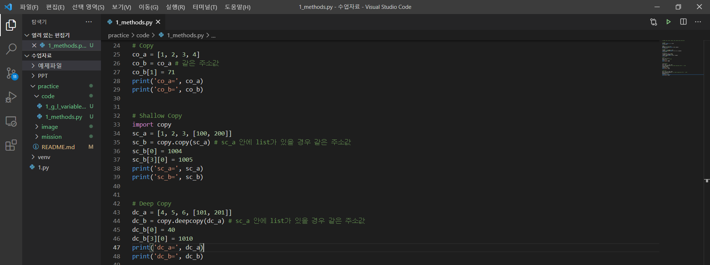

## 1주차 미션- Chapter 1. Python Advanced(1) (+ Chapter 0. 환경설정)

#### 주요개념, 배운내용 및 느낀점

- 가상환경 + Vscode : Comand Prompt에서 가상환경을 새로 만들어주고, 그걸 키는 동작을 배웠고, VS Code에서 Extensions 설치 등을 했다. 나는 Git bash를 터미널로 쓰므로, 이를 활용해 학습하였다. (+ Google Colab, Jupyter Notebook 보다는 VS Code를 )

  

  

  

(각각 가상환경 만들기, 가상환경 실행하기, Extensions 설치하기에 해당한다!)

- Scope, Global, Nonlocal, Locals, Globals : Nonlocal 개념을 처음봤다.. 신기했다. (Descriptor도 처음들어봤..) Globals()라는 걸 선언하면 dict구조로 전역변수를 꺼내주는 지도 몰랐다. 그리고 개인적으로 함수 안에서 'global 변수명' 을 활용하는 경우가 많았는데, 이번 강의를 보니, 개발자들 사이에서 쓰지 않는 것이 암묵적인 룰이라는 사실을 알았다! 주의해야겠다고 생각했다.

  

  

  

(전역변수와 지역변수, 그리고 nonlocal 개념을 활용해본 사진 / locals(), globals()를 사용해본 사진 / 그리고 결과물에 해당하는 사진들이다. )

- lambda, map, filter, reduce, copy, Shallow copy, Deep copy : 데이터 분석을 할 때, labmda랑 filter를 종종 쓰곤 한다. reduce 같은 경우에는 거의 안썼다. lambda는 그냥 손이 안가서 즐겨쓰는 편은 아니었는데, lambda가 사용 시 즉시 소멸된다는 점은 처음 알았다! (일반함수는 재사용성을 위해 메모리에 저장된다고 한다.) 그리고 컴퓨터 프로그래밍 처음 배웠을 때 신기했던 Copy, Shallow Copy, Deep Copy 개념의 강의도 있었고, 복습할 수 있는 시간이었다.

  

  

  

(lambda, map, filter, reduce의 사용 예시 / Copy 세 종류의 사용 예시 / 그리고 전체 코드를 돌려본 결과이다.)

- context manager : with문과 함께, enter, exit 함수 및 time 라이브러리를 활용하여 클래스가 동작하는 시간을 재봤다.

  

[모두를 위한 파이썬 : 필수 문법 배우기 Feat. 오픈소스 패키지 배포 (Inflearn Original)](https://www.inflearn.com/course/%ED%94%84%EB%A1%9C%EA%B7%B8%EB%9E%98%EB%B0%8D-%ED%8C%8C%EC%9D%B4%EC%8D%AC-%EC%A4%91%EA%B3%A0%EA%B8%89/dashboard )

