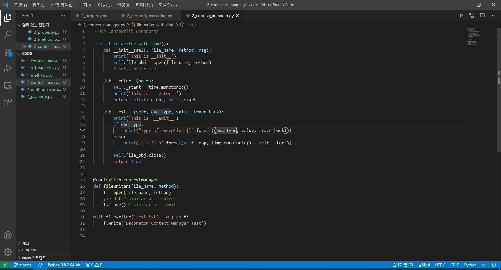
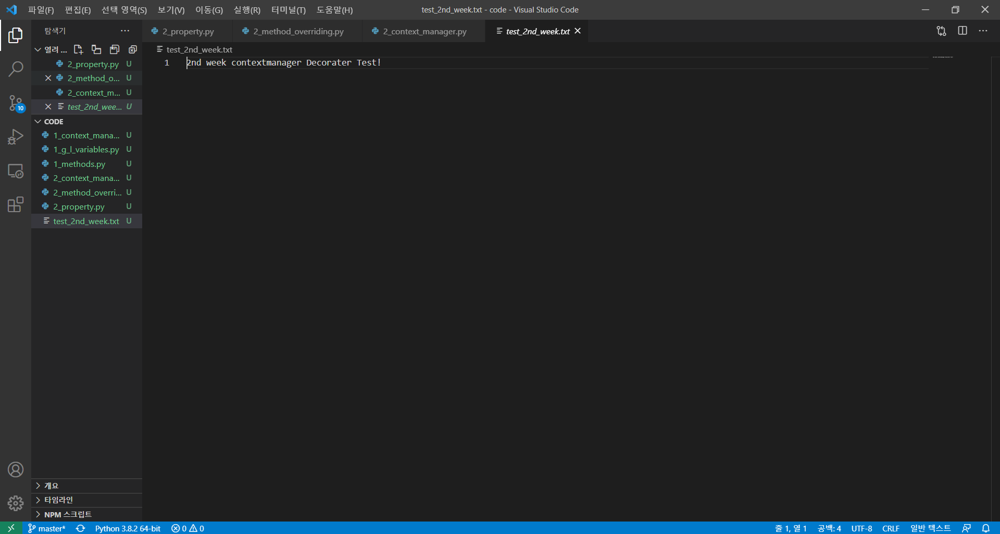
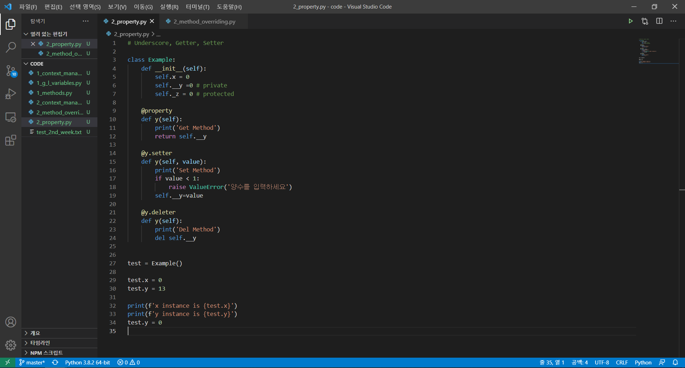
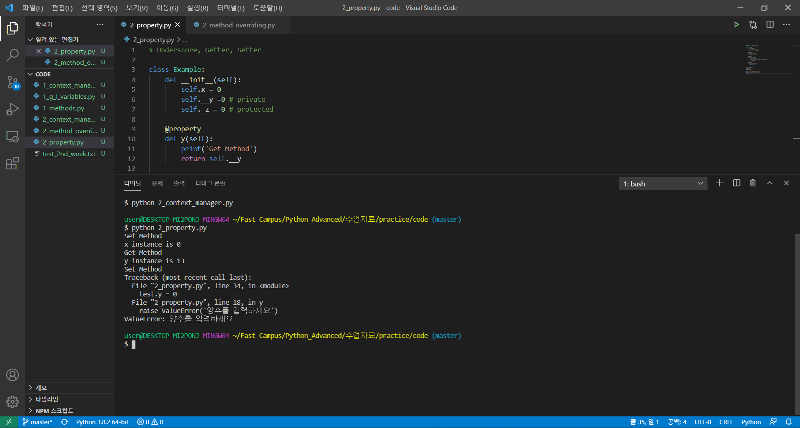
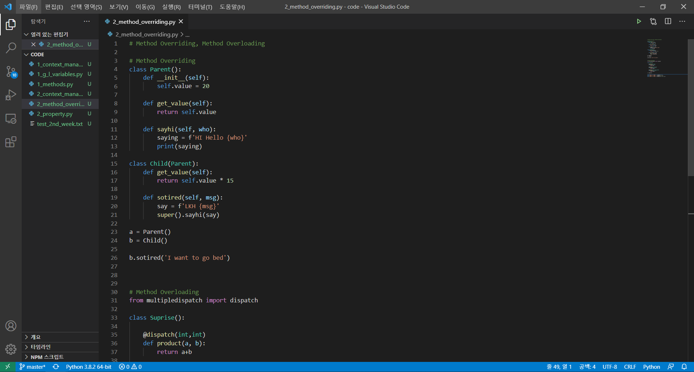
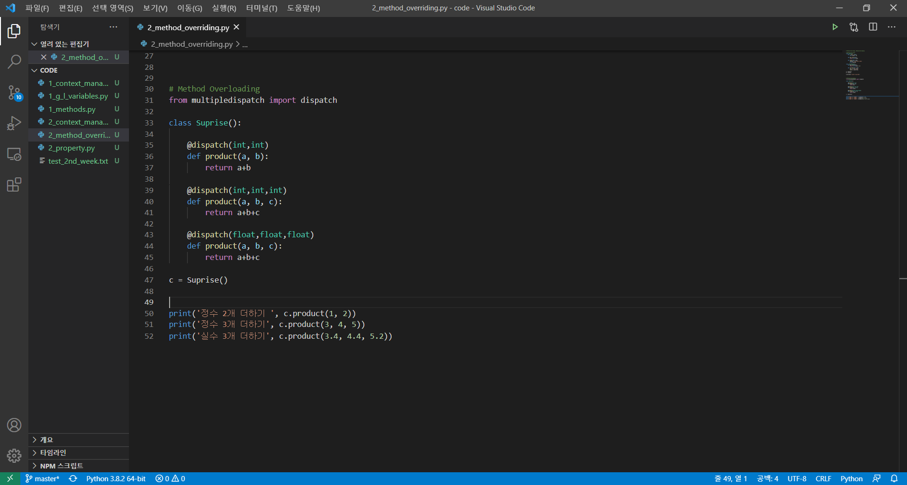
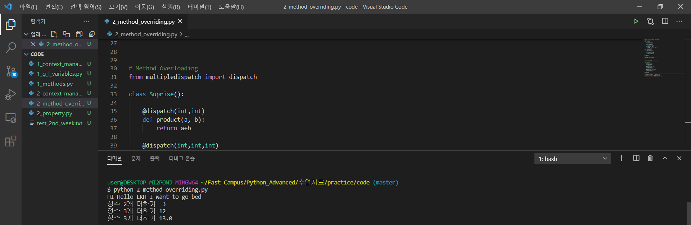

## 2주차 미션- Chapter 2. Python Advanced(2) 

#### 주요개념, 배운내용 및 느낀점

- Context Manager Annotation : Contextlib 데코레이터를 사용해봤습니다. 우선 지난 주에 Context Manager라는 개념에 대해 간단하게 배우고, 직접 클래스를 만들어봤는데요, 이번 시간에는 Contextlib.contextmanager 데코레이터를 사용하여 클래스를 간단하게 만들어보는 경험을 했습니다. (_enter, exit 함수를 안 만들어줘도 되었던 게 신기했습니다!)

  

  

(Contextlib.contextmanager decorator를 활용해서 클래스를 만들었고, 이를 활용해서 test.txt 파일을 새로 만들었습니다. 첫 번째 사진속에 위에 있는 클래스와 아래 클래스는 Timer기능을 빼고 똑같은 기능들이 있다는 것이 특징입니다. enter=>yield / exit => close()로 대체해준 걸로 이해하면 됩니다.)

- underscore, 접근지정자, Getter, Setter, @Property : 파이썬을 쓰면서 클래스에서 _ , __ 로시작하는 함수 혹은 변수를 본 적이 꽤 있었으나, 정확히 무슨 의미인지 몰랐다. 언더스코어 유무, 혹은 길이에 따라 Public, Protected, Private로 구분된다는 점을 알았습니다. 특히 Private에 접근하려면  *인스턴스.클래스__y'* 이런식으로 접근해야되는 게 신기했습니다. 좀더 Private 변수에 접근 하기 쉽게 하기 위해 Getter나 Setter를 쓰는 방법 (각각 호출, value 할당 하는 걸로 이해 ), 그리고 Property를 활용하는 방법을 배웠고, @property 매서드는 정말 신기했습니다.

  

  

(인자 조건 설정을 통해 Error를 만들 수도 있다. Private 인자에 쉽게 접근하는 게 사진의 포인트다!)

- Method Overriding, Overloading, @dispatch -  클래스를 배울 때 두 개념을 들어 본 적이 있다. (포켓몬스터 게임을 직접 만들어 보면서 늘은 내 클래스 이해 능력치) 우선적으로 서브클래스에서 부모 클래스를 호출 후 사용할 수 있다는 점, 그리고 메소드 재 정의 후 사용이 가능하다는 점이 특징이다. @dispatch의 경우 Multipledispatch 패키지를 활용한 것인데, 정말 신기했다. (같은 함수 이름인데, 인풋 종류에 따라 다른 함수를 호출 시키다니...)

  

  

  

(Overriding 관련 클래스 함수, 그리고 @dispatch를 활용한 클래스, 그리고 실행한 결과 사진입니다.)

[모두를 위한 파이썬 : 필수 문법 배우기 Feat. 오픈소스 패키지 배포 (Inflearn Original)](https://www.inflearn.com/course/%ED%94%84%EB%A1%9C%EA%B7%B8%EB%9E%98%EB%B0%8D-%ED%8C%8C%EC%9D%B4%EC%8D%AC-%EC%A4%91%EA%B3%A0%EA%B8%89/dashboard )

