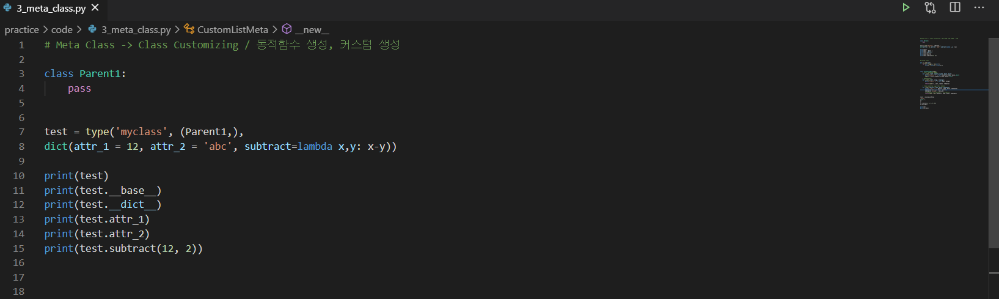
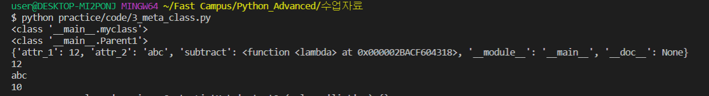
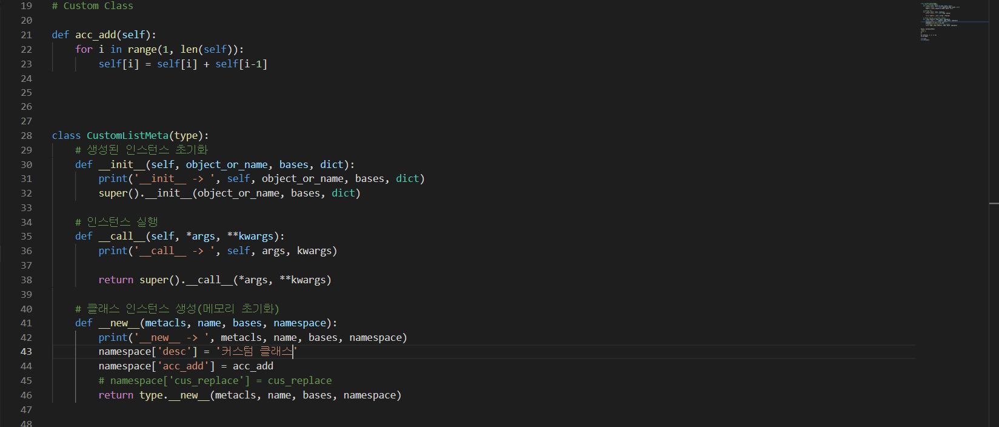
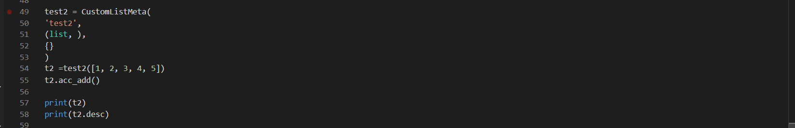
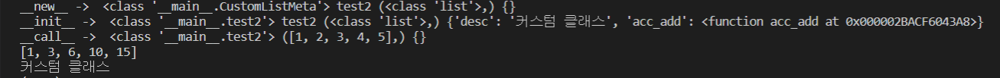

## 3주차 미션- Chapter 3. Meta Class 

#### 주요개념, 배운내용 및 느낀점

- 파이썬 유저의 99%가 몰라도 되는 Meta Class 개념을 배워봤습니다. (저도 아직 이해가 잘 안되는 부분이 있지만..ㅠ) 이 강의에서 가장 중요한 핵심 내용은 **모든 클래스의 메타 클래스는 type인 점과, type의 메타 클래스는 자기 자신이라는 점입니다.** 또한 메타클래스는 동적 생성, 커스텀생성이 가능합니다. 더 자세한 내용은 코드와 함께 살펴보겠습니다.

  

동적 생성과 관련된 내용입니다. 그리고 해당코드를 실행하면 아래와 같은 결과 값이 나옵니다!

  

개인적으로 특히, 클래스 내의 함수를 lambda를 사용하여 동적으로 생성해줬다는 게 매우 신기했습니다.

아래는 커스텀 생성 관련 코드입니다. 특정 함수를 선언했고, Meta Class에서 해당 함수를 엮어 동작시킬 수 있는 것으로 저는 이해를 했습니다. 그리고 아래 Class에서는 new, init, call 순으로 매서드가 실행이 됩니다.

  

  

해당 코드를 돌린 결과, 아래와 같은 결과가 나옵니다.

  

오늘 굉장히 심도있는 개념인 Meta Class관련 내용을 다뤄봤는데, 이 계기로 파이썬과 더 친해질 수 있었습니다.

[모두를 위한 파이썬 : 필수 문법 배우기 Feat. 오픈소스 패키지 배포 (Inflearn Original)](https://www.inflearn.com/course/%ED%94%84%EB%A1%9C%EA%B7%B8%EB%9E%98%EB%B0%8D-%ED%8C%8C%EC%9D%B4%EC%8D%AC-%EC%A4%91%EA%B3%A0%EA%B8%89/dashboard )

